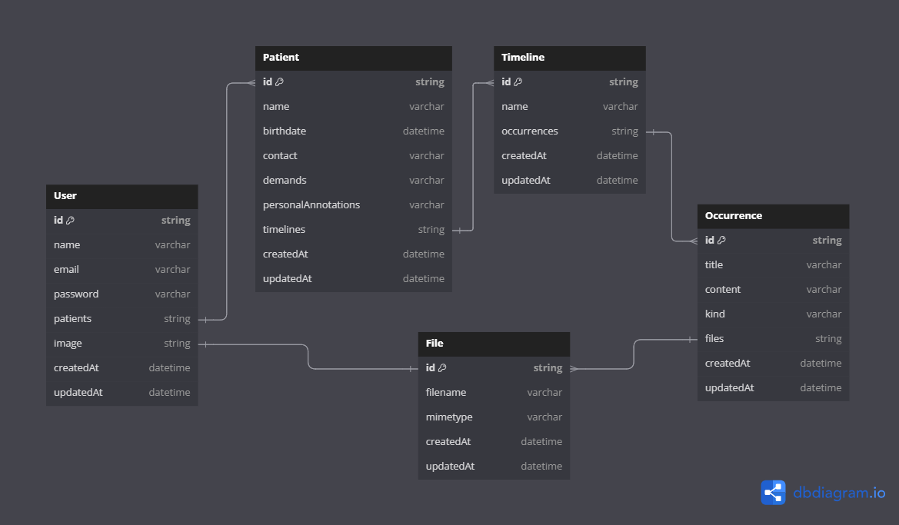

# Wexer Psi - Backend 💬🆘💾

## Final Project - Patient and Medical Records Manager 🧠


### Wexer Psi is a project developed to manage consultations and records for psychologists. We used Node.js as the development platform and MongoDB as the database.

**Project Name:** Wexer Psi 💬🆘💾  
**Development Start Date:** 07/03/2024 ⏩  
**Development End Date:** 07/30/2024 🏁  
**Status:** Completed ✅ <br />
**Project Completion:** 100% 🔥

**Technologies Used:**

- 💚 **Node.js** as the development environment.
- 🟧🟦 **JavaScript/TypeScript** as the programming language.
- 📦 **NPM** for package/library management.
- 🔛 **Express.js** as the web framework.
- 🍃 **MongoDB** as the non-relational database.
- 🦘 **Mongoose** for data modeling.
- 🛡️ **JWT** for user authentication.
- 🔐 **Bcrypt** for encrypting sensitive data.
- 🗝️ **Dotenv** for environment variable management.
- 🚈 **Railway** for project deployment and CI/CD.
- 🔄 **Babel** for transpiling TS/JS.
- 🧪 **Jest** for automated testing.
- 🟠 **Postman** as a visual interface for request testing.

🚈 **Deployment Link on Railway:** [_link_](https://wexer.up.railway.app)  
🟠 **Postman Import Link:** [_link_](./assets/postman/wexer-postman-import.json)  
📋 **Task Planning File Link:** [_link_](./planning.todo)

## Project Description 📝

The goal of this project is to develop the backend responsible for managing information related to users, patients, timelines, occurrences, and files.

The focus is to provide assistance to psychologists in their consultations and medical records. Psychologists can register patients, create timelines, record occurrences, and attach files.

This backend was developed to be robust, scalable, and secure, providing a solid foundation for building a complete web application.

The Wexer Psi Backend was the final project of the third module at [Arnia - Programming School](https://arnia.com.br).

## Key Features 🔧

1. **Authentication:** Secure authentication system to protect the application's routes and resources.
2. **User Management:** Creation, updating, and deletion of users, including profile information.
3. **Data Management:** Handling data related to psychologists, patients, medical histories, and attachments.
4. **Relationships:** Relationships between psychologists, patients, medical histories, and occurrences, ensuring data integrity.
5. **Pagination:** Implementation of pagination in result lists to improve performance and usability.
6. **Unit Testing:** Automated tests to ensure the quality and correct functionality of routes and services.

## Project Structure 🗂️

The backend structure follows a layered architecture, with a clear separation of responsibilities, making the project more readable and easier to maintain.

Main folders and files:

- **`app`**: Main logic, divided into modules for each system entity (Auth, User, Patient, Timeline, Occurrence, File).
- **`config`**: Additional configurations, including MongoDB connection.
- **`middlewares`**: Middlewares for authentication and file uploads.
- **`routes`**: API route definitions, each file corresponding to a specific module.
- **`utils`**: Helper functions and utilities used throughout the application.
- **`server.ts`**: Main file that initializes the Express server.
- **`types`**: TypeScript type definitions and interfaces used in the project.

## Development Stages 🛠️

The development followed clear stages, from environment setup to final documentation. For details, check the [`planning.todo`](./planning.todo) file in the root of the project.

## Configured Routes 🚀

The [`wexer-postman-import.json`](./assets/postman/wexer-postman-import.json) file in the project contains all configured routes. You can import this file into Postman and start using the routes without manually exploring the code. Additionally, the JSON bodies for tests are already saved in the files.

## Railway/MongoDB Deployment Notice ⚠️

Be aware that MongoDB or Railway may be deactivated due to inactivity. If this happens, you may need to clone the repository to your machine and connect to the database locally. For this, you'll need to configure the environment variables. In the [installation](#installing-the-project) section of this README, you will find instructions on how to set up the environment variables.

## Diagram 📋



## Installing the Project

Clone the repository:

```bash
git clone https://github.com/LadyJessie19/wexerBackend.git
```

Install the dependencies:

```bash
npm install
```

Set up the environment variables:

Create a `.env` file with the necessary variables. An example `.env.example` is available in the root of the project.

- **URL:** MongoDB database address.
- **PORT:** Port where the Express server will start.
- **SECRET_KEY:** Secret key for creating JWT tokens.
- **USER_URL:** The url that must be concatenated with the filename to return the file with the link for the user. More info at [Running with Postman](#running-with-postman).

## Running the Application 🚀

```bash
# development
npm run dev
```

```bash
# production
npm start
```

## Tests ✅

```bash
# unit tests
npm run test
```

```bash
# coverage report
npm run cov
```

## Running with Postman

1. Import the [`wexer-postman-import.json`](./assets/postman/wexer-postman-import.json) file into Postman.
2. Create a new environment in Postman.
3. Set the `base_url` environment variable to the server address:

   - If running locally, the `base_url` will be `http://localhost:<selected_port>`.
   - If running on Railway, the `base_url` will be `https://wexer.up.railway.app`.
   - **Note**: I prefer not to include the "/" at the end of the `base_url` variable, so I add it manually to each route.

4. Set another environment variable named `token` for the authentication token:

   - **Explanation**: To automate the tests, I created a script within the `Login` route that generates the token and saves it to the environment variable. A test user is available in the database (if still active) with the following credentials:

   ```json
   {
     "email": "email@email.com",
     "password": "password"
   }
   ```

- **Note**: All of this is already saved in the Postman import file. Just run the request to `{{base_url}}/auth` to automatically update the `token` variable. Also, all requests are already configured with `Bearer Token` in the _Authorization_ tab. 🥳

5. **Using File URLs**:
   - To access the files uploaded to the server, use the `base_url` variable followed by the `/files/static` route and the file name. For example:
     ```plaintext
     {{base_url}}/files/static/filename.extension
     ```
   - This link will allow you to view or download the file directly in your browser.

All set! Now you can test the routes and access the files 😉.

## Development Team 🙋‍♀️


- Developer: [Jessie M Bentes](https://github.com/LadyJessie19)

## How to Contribute 🆘

1. Fork the project.
2. Create a new branch (`git checkout -b feature/new-feature`).
3. Commit your changes (`git commit -am 'Add new feature'`).
4. Push to the branch (`git push origin feature/new-feature`).
5. Create a Pull Request.

## License 🧐

This project is licensed under the [MIT License](https://opensource.org/licenses/MIT).
