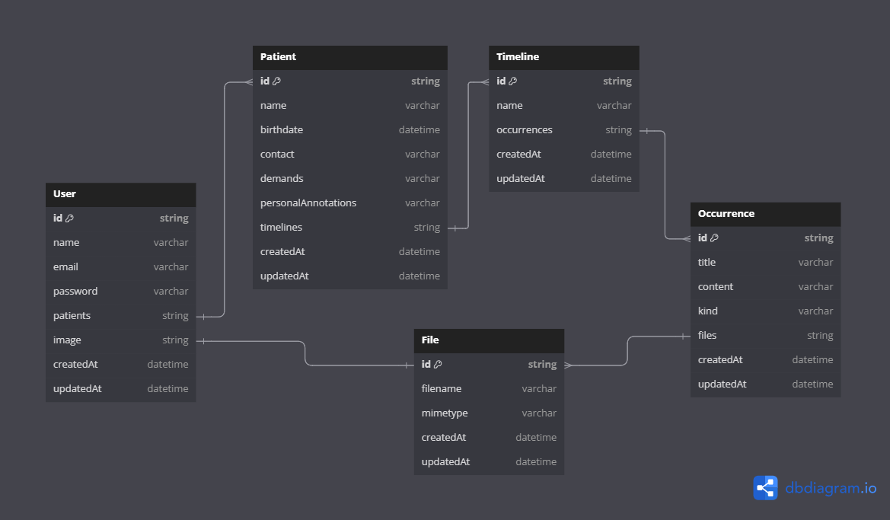

# Wexer Psi - Backend 💬🆘💾

###### _Pssst! English version of this README is available [here](./EN_US.md)._

## Projeto final - Gerenciador de Pacientes e Registros Médicos 🧠


### Wexer Psi é um projeto desenvolvido para gerenciar atendimentos e registros de psicólogos. Utilizamos Node.js como plataforma de desenvolvimento e MongoDB como banco de dados.

**Nome do Projeto:** Wexer Psi 💬🆘💾  
**Data de Início do Desenvolvimento:** 03/07/2024 ⏩  
**Data de Término do Desenvolvimento:** 30/07/2024 🏁  
**Status:** Concluído ✅
**Aproveitamento do Projeto:** 100% 🔥

**Tecnologias Utilizadas:**

- 💚 **Node.js** como ambiente de desenvolvimento.
- 🟧🟦 **JavaScript/Typescript** como linguagem de programação.
- 📦 **NPM** para o gerenciamento de pacotes/bibliotecas.
- 🔛 **Express.js** como framework web.
- 🍃 **MongoDB** como banco de dados não relacional.
- 🦘 **Mongoose** para modelagem de dados.
- 🛡️ **JWT** para autenticação de usuários.
- 🔐 **Bcrypt** para encriptação de dados sensíveis.
- 🗝️ **Dotenv** para controle de variáveis de ambiente.
- 🚈 **Railway** para deploy e CI/CD do projeto.
- 🔄 **Babel** para transpilar TS/JS.
- 🧪 **Jest** para testes automatizados.
- 🟠 **Postman** como interface visual para teste de requisições.

🚈 **Link de Deploy no Railway:** [_link_](https://wexer.up.railway.app)  
🟠 **Link para Importação Postman:** [_link_](./assets/postman/wexer-postman-import.json)  
📋 **Link para o Arquivo de Planejamento de Tarefas:** [_link_](./planning.todo)

## Descrição do Projeto 📝

O objetivo deste projeto é desenvolver o backend responsável por gerenciar informações relacionadas a usuários, pacientes, linhas do tempo, ocorrências e arquivos.

O foco é fornecer auxílio para psicólogos em seus atendimentos e registros médicos. Psicólogos podem cadastrar pacientes, criar linhas do tempo, registrar ocorrências e anexar arquivos.

Este backend foi desenvolvido para ser robusto, escalável e seguro, fornecendo uma base sólida para a construção de uma aplicação web completa.

O Wexer Psi Backend foi o projeto final do terceiro módulo da [Arnia - Escola de Programação](https://arnia.com.br).

## Funcionalidades Principais 🔧

1. **Autenticação:** Sistema de autenticação seguro para proteger as rotas e recursos da aplicação.
2. **Gerenciamento de Usuários:** Criação, atualização e exclusão de usuários, incluindo informações de perfil.
3. **Gerenciamento de Dados:** Manipulação de dados relacionados a psicólogos, pacientes, históricos médicos e anexos.
4. **Relacionamentos:** Relações entre psicólogos, pacientes, históricos médicos e ocorrências, garantindo a integridade dos dados.
5. **Paginação:** Implementação de paginação em listas de resultados para melhorar desempenho e usabilidade.
6. **Testes Unitários:** Testes automatizados para garantir a qualidade e funcionalidade correta das rotas e serviços.

## Estrutura do Projeto 🗂️

A estrutura do backend segue uma arquitetura de camadas, com separação clara de responsabilidades, tornando o projeto mais legível e facilitando a manutenção.

Principais pastas e arquivos:

- **`app`**: Lógica principal, dividida em módulos para cada entidade do sistema (Auth, User, Patient, Timeline, Occurrence, File).
- **`config`**: Configurações adicionais, incluindo a conexão com o MongoDB.
- **`middlewares`**: Middlewares para autenticação e upload de arquivos.
- **`routes`**: Definição das rotas da API, cada arquivo corresponde a um módulo específico.
- **`utils`**: Funções auxiliares e utilitários usados em toda a aplicação.
- **`server.ts`**: Arquivo principal que inicializa o servidor Express.
- **`types`**: Definições de tipos e interfaces TypeScript usadas no projeto.

## Etapas de Desenvolvimento 🛠️

O desenvolvimento seguiu etapas claras, desde a configuração do ambiente até a documentação final. Para detalhes, consulte o arquivo [`planning.todo`](./planning.todo) na raiz do projeto.

## Rotas Configuradas 🚀

O arquivo [`wexer-postman-import.json`](./assets/postman/wexer-postman-import.json) no projeto contém todas as rotas configuradas. Você pode importar esse arquivo no Postman e começar a usar as rotas sem precisar explorar o código manualmente. Além disso, os bodies JSON para testes já estão salvos nos arquivos.

## Aviso sobre Deploy Railway/MongoDB ⚠️

Esteja ciente de que o MongoDB ou Railway podem estar desativados devido à inatividade. Caso isso aconteça, pode ser necessário clonar o repositório na sua máquina e conectar ao banco de dados localmente. Para isso, você precisará configura as variáveis de ambiente. Na sessão de [instalação](#instalando-o-projeto) deste README, você encontrará instruções sobre como configurar as variáveis de ambiente.

## Diagrama 📋



## Instalando o projeto

Clone o repositório:

```bash
git clone https://github.com/LadyJessie19/wexerBackend.git
```

Instale as dependências:

```bash
npm install
```

Configure as variáveis de ambiente:

Crie um arquivo `.env` com as variáveis necessárias. Um exemplo `.env.example` está disponível na raiz do projeto.

- **URL:** Endereço do banco de dados MongoDB.
- **PORT:** Porta onde o servidor Express será iniciado.
- **SECRET_KEY:** Chave secreta para a criação de tokens JWT.
- **USER_URL:** O endereço que deve ser concatenado com filename para retornar o arquivo com link para o usuário. Mais informações na seção [Rodando com Postman](#rodando-com-postman).

## Executando a Aplicação 🚀

```bash
# desenvolvimento
npm run dev
```

```bash
# produção
npm start
```

## Testes ✅

```bash
# testes unitários
npm run test
```

```bash
# Relatório de cobertura
npm run cov
```

## Rodando com Postman

1. Importe o arquivo [`wexer-postman-import.json`](./assets/postman/wexer-postman-import.json) no Postman.
2. Crie um novo ambiente no Postman.
3. Defina a variável de ambiente `base_url` com o endereço do servidor:

   - Se estiver rodando localmente, a base_url será `http://localhost:<porta_selecionada>`.
   - Se estiver rodando no Railway, a base_url será `https://wexer.up.railway.app`.
   - **Nota**: Prefiro não incluir a barra "/" no final da variável `base_url`, então a adiciono manualmente em cada rota.

4. Defina outra variável de ambiente chamada `token` para o token de autenticação:

   - **Explicação**: Para automatizar os testes, criei um script dentro da rota de `Login` que gera o token e o salva na variável de ambiente. Há um usuário de teste disponível no banco de dados (caso ainda esteja ativo) com as seguintes credenciais:

   ```json
   {
     "email": "email@email.com",
     "password": "password"
   }
   ```

- **Nota**: Tudo isso já está salvo no arquivo de importação do Postman. Basta rodar a requisição para `{{base_url}}/auth` para que a variável `token` seja atualizada automaticamente. Ah, e todas as requisições já estão configuradas com `Bearer Token` na aba _Authorization_. 🥳

5. **Utilizando URLs dos Arquivos**:
   - Para acessar os arquivos enviados ao servidor, utilize a variável `base_url` seguida pela rota `/files/static` e o nome do arquivo. Por exemplo:
     ```plaintext
     {{base_url}}/files/static/nome_do_arquivo.extensao
     ```
   - Este link permitirá que você visualize ou baixe o arquivo diretamente no navegador.

Prontinho! Agora você já pode testar as rotas e acessar os arquivos 😉.

## Equipe de Desenvolvimento 🙋‍♀️


- Desenvolvedora: [Jessie M Bentes](https://github.com/LadyJessie19)

## Como Contribuir 🆘

1. Faça um fork do projeto.
2. Crie uma nova branch (`git checkout -b feature/nova-funcionalidade`).
3. Commit suas alterações (`git commit -am 'Adiciona nova funcionalidade'`).
4. Faça o push para a branch (`git push origin feature/nova-funcionalidade`).
5. Crie um Pull Request.

## Licença 🧐

Este projeto é licenciado sob a [Licença MIT](https://opensource.org/licenses/MIT).
